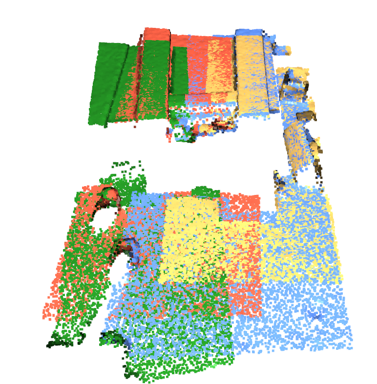
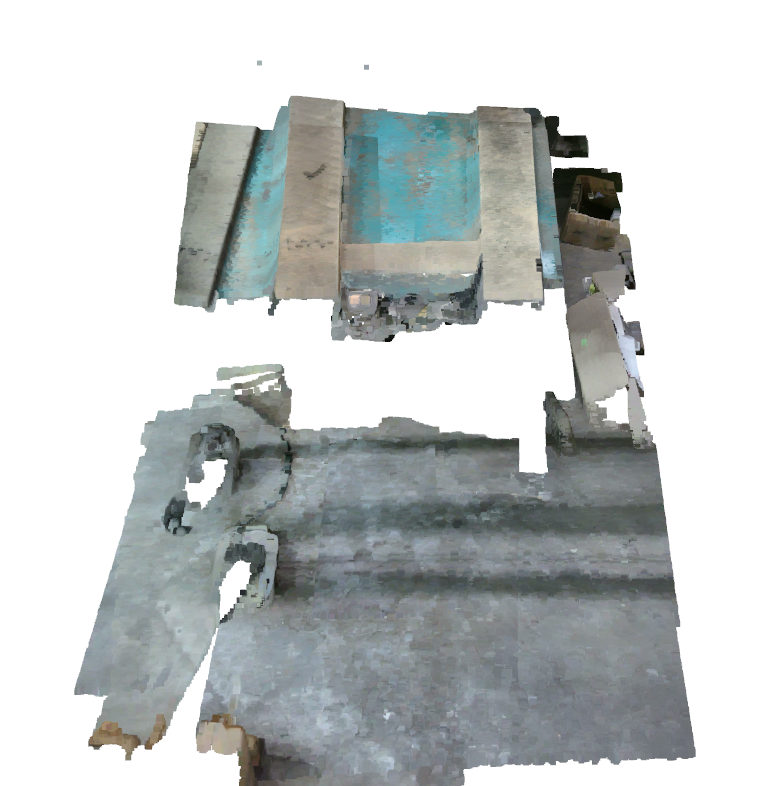

# PointCloudStitcher

## Overview
PointCloudStitcher is a tool designed to stitch multiple `.ply` files into a single `.ply` file. It utilizes a high-performance point cloud registration algorithm, optimized for partial overlaps of 10–30%.

<p align="center">
  
  
</p>

## Requirements
### Data
- `.ply` files must have at least 30% partial overlap. A higher overlap percentage generally results in a more accurately stitched final file.
- Files should be named in ascending or alphabetical order, ensuring that each file overlaps with the next one in sequence.
- Files should be located in `./data/experiments/exp/ply`, relative to the repository directory.
- It's recommended to lightly clean the point clouds—e.g., by removing outliers or distant points in CloudCompare—to improve alignment and results.

### Software
- **CUDA**: Version 11.X (Tested in 11.8 and 11.7)
- **cuDNN**: Version > 8.9 (Tested – Other versions may also work)

## Installation
Follow these steps to install the software:

```bash
# Create a new virtual environment (recommended)
conda create -n pointcloud_stitcher python==3.8
conda activate pointcloud_stitcher

# Clone the repository
git clone https://github.com/djetshu/PointCloudStitcher.git # git@github.com:djetshu/PointCloudStitcher.git
cd PointCloudStitcher

# Install PyTorch 1.13 (Ensure compatibility with CUDA 11.8)
pip install torch==1.13.1+cu117 torchvision==0.14.1+cu117 torchaudio==0.13.1 --extra-index-url https://download.pytorch.org/whl/cu117


# Install dependencies
pip install -r requirements.txt

# Build the package
python setup.py build develop
```

## Pre-trained Weights
Download the `geotransformer-3dmatch.pth.tar` weight file from the [release page](https://github.com/qinzheng93/GeoTransformer/releases).

After downloading, place the weights (`geotransformer-3dmatch.pth.tar`) in the `weights/` directory.

## Quick Test
### Steps:
1. Ensure `.ply` files are located in `./data/experiments/exp/ply`. If the `exp` or `ply` directories do not exist, create them.

### Data Organization
The dataset should be structured as follows:
```text
--data
   |--experiments
       |--exp
           |--ply
               |--rgb_0.ply
               |--rgb_1.ply
               |--rgb_2.ply
               |--rgb_3.ply
           |--npy (Created by the program)
           |--output (Created by the program)
```

2. Run the following command:

```bash
python pointcloud_stitching.py --data-path data/experiments/exp
```

### Arguments:
- `--data-path`: Path to the experiment directory (default: `data/experiments/exp`).
- `--weights`: Path to the pre-trained model weights (default: `./weights/geotransformer-3dmatch.pth.tar`).
- `--no-graph`: Disables graphical visualization of the stitching process.
- `--output`: Directory for saving the final `.ply` file (default: `data/experiments/exp/output`).

3. Once processing is complete, the final `.ply` file will be located in `data/experiments/exp/output`.

## Geometric Transformer for Fast and Robust Point Cloud Registration
PointCloudStitcher is based on [GeoTransformer](https://github.com/qinzheng93/GeoTransformer), an implementation of the paper:

[Geometric Transformer for Fast and Robust Point Cloud Registration](https://arxiv.org/abs/2202.06688)

### Tested Environment:
- **OS**: Windows 11 (Branch: main) and Ubuntu 22.04 (Branch: dev/pointcloud_stitching)
- **Python**: 3.8
- **PyTorch**: 1.13.1
- **CUDA**: 11.8
- **cuDNN**: 8.9

